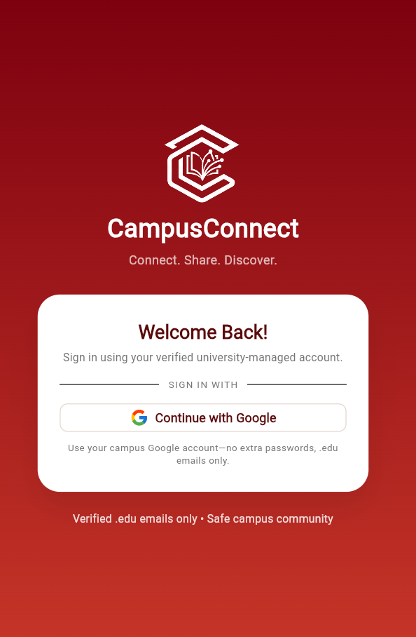
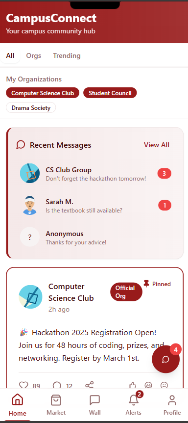
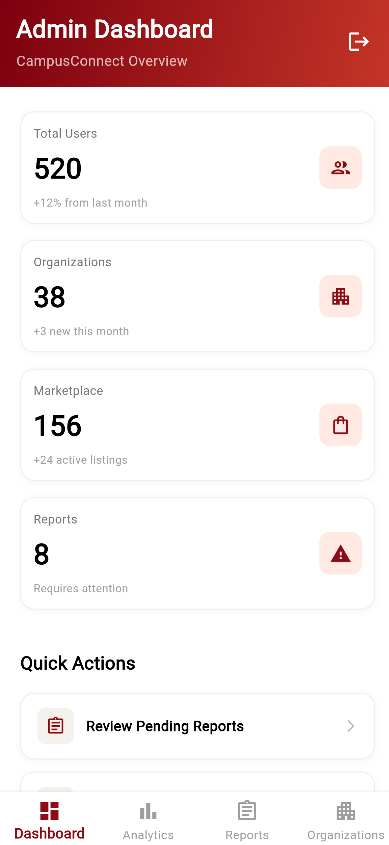
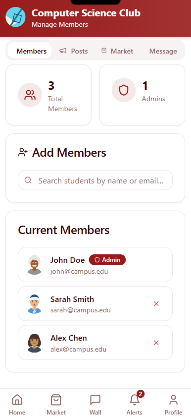
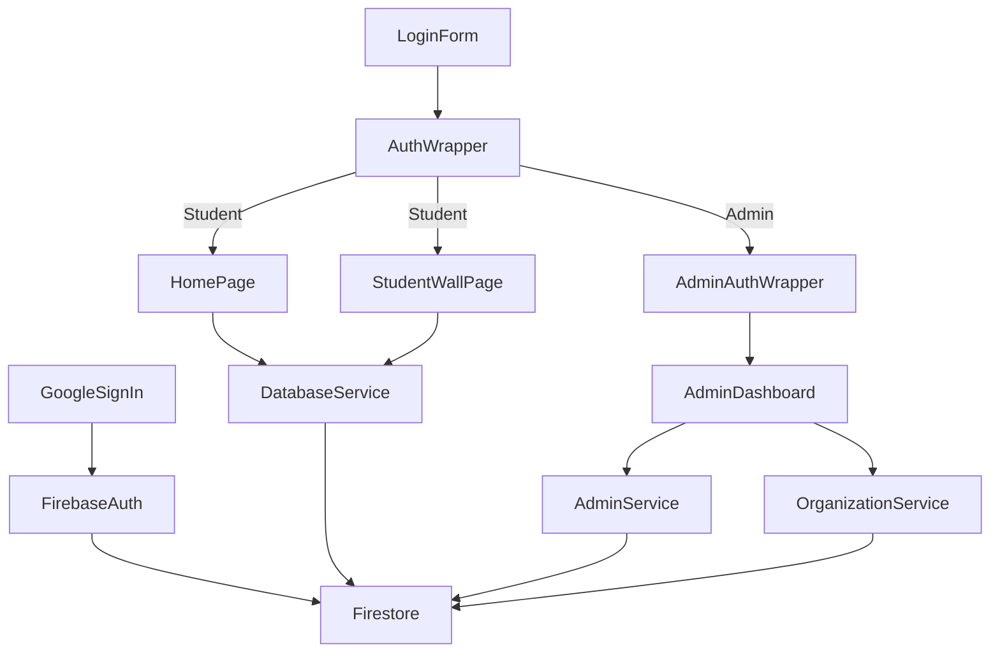

# CampusConnect

CampusConnect is a Flutter + Firebase application built for campus communities. It enforces campus-only Google authentication, presents an integrated student engagement hub, and equips administrators with governance tools.

---

## 1. Project Brief
| Item | Details |
| --- | --- |
| **Audience** | Students, organization officers, campus administrators |
| **Objective** | Centralize announcements, confessions, marketplace listings, and moderation workflows |
| **Technology Stack** | Flutter 3.x, Dart, Firebase Auth + Firestore + Storage, Google Sign-In |
| **Deployment Targets** | Android, iOS, Web |

📷 **Screenshots**

<p align="center">
  
  
</p>
<p align="center">
  
  
</p>

---

## 2. Interface Summary
| Role | Primary Screens | Notable Behaviors |
| --- | --- | --- |
| **Guest** | `LoginForm` | Google Sign-In limited to school-managed Google domains; non-campus accounts are logged out. |
| **Student** | `HomePage`, `StudentWallPage`, `MarketplacePage`, `MessagesPage`, `AlertsPage`, `ProfilePage` | Filter chips mix org announcements + confessions, floating action button opens messages, navigation handled by `CampusBottomNav`. |
| **Admin** | `AdminDashboard`, `AdminAnalytics`, `AdminReports`, `AdminOrganizations` | Access gated through `AdminAuthWrapper` + `admin_emails` Firestore collection; dashboards show KPIs, quick actions, and org CRUD. |

---

## 3. Feature Overview
1. **Campus-restricted authentication** – Google OAuth with domain enforcement via `GoogleAuth` plus automatic profile creation.
2. **Student Wall and Marketplace** – Real-time feed for announcements, confessions, and listings backed by `DatabaseService`.
3. **Messaging access** – Floating action button surfaces unread counts and deep-links to `/messages`.
4. **Organization lifecycle management** – Admin workflows for adding, editing, archiving, and syncing org membership (`OrganizationService`).
5. **Administrative analytics and moderation** – KPI cards, quick actions, and report handling across the admin module.

---

## 4. Architecture Snapshot


Key notes:
- Routes live in `lib/main.dart`.
- Firestore collections: `users`, `posts`, `organization_announcements`, `admin_emails`, `conversations`.
- `AdminAuthWrapper` swaps between admin/student layouts based on Firestore lookup.

---

## 5. Setup Checklist
1. **Install prerequisites**
   - Flutter 3.24+ (`flutter --version`)
   - Dart SDK 3.x (bundled with Flutter)
   - Firebase CLI (`npm install -g firebase-tools`)
2. **Clone and install packages**
   ```bash
   git clone https://github.com/<your-org>/CampusConnect.git
   cd CampusConnect
   flutter pub get
   ```
3. **Configure Firebase services**
   - Run `flutterfire configure` → generates `lib/firebase_options.dart`.
   - Enable Google Sign-In in Firebase Authentication.
   - Create collections:
     - `users` – auto-created profiles
     - `posts` – wall + marketplace entries
     - `organization_announcements`
     - `admin_emails` – `{ email: "admin@yourcampus.edu", isActive: true }`
4. **Prepare assets**
   - Logo: `assets/icons/logo.png`
   - Google icon: `assets/images/google-icon.png`
   - Update `pubspec.yaml` if paths change.

---

## 6. Project Structure (abridged)
```
lib/
├── main.dart
├── LoginForm.dart
├── home_page.dart
├── student_wall_page.dart
├── marketplace_page.dart
├── admin/
│   ├── admin_dashboard.dart
│   ├── admin_analytics.dart
│   ├── admin_reports.dart
│   └── admin_organizations.dart
├── services/
│   ├── auth/google_auth.dart
│   ├── admin/admin_service.dart
│   └── database/database_service.dart
└── widgets/
    ├── campus_bottom_nav.dart
    ├── admin_bottom_nav.dart
    └── floating_messages_button.dart
```

---

## 7. Development Commands
| Command | Description |
| --- | --- |
| `flutter pub get` | Install dependencies |
| `flutter run` | Launch debug build |
| `flutter run -d chrome` | Web preview |
| `flutter build apk` | Release APK |
| `flutter build web` | Production web bundle |

---

## 8. Contribution Guidelines
1. Create a feature branch from `main`.
2. Run `flutter analyze` and relevant tests before submitting pull requests.
3. Update screenshots and documentation when UI changes materially affect behavior.

---

## 9. License
MIT © 2025 CampusConnect contributors.
